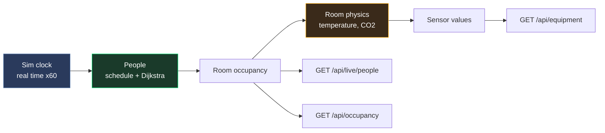

# Live Simulation API

The server runs a *living building*: a population of simulated people that move
between the real rooms of the A-building along the real navigation graph, and
equipment sensors whose values follow from where those people are. It is on by
default (`--livesim`, see [Flags](#flags)).



| Endpoint | Purpose |
|----------|---------|
| `GET /api/live/people` | Everyone currently inside, with position |
| `GET /api/live/state` | Simulation clock and aggregate figures |
| `GET /api/live/schedule` | The synthesized weekly lecture timetable |
| `POST /api/live/reset` | Re-seed / rewind the simulation |

The simulation also writes through the **existing** endpoints:

- `GET /api/occupancy` — per-room headcount, updated as people move
- `GET /api/equipment` — live temperature, CO2, humidity, presence, occupancy
  count and energy sensor values

---

## People

```
GET /api/live/people[?level=level1]
```

```bash
curl http://localhost:9090/api/live/people
curl "http://localhost:9090/api/live/people?level=level2"
```

```json
[
  {
    "id": "sim-p001",
    "name": "Hanna Sandberg",
    "role": "staff",
    "state": "in_room",
    "room": "1555",
    "level": "level0",
    "x": 39.52,
    "y": 320.28,
    "heading": 309.9,
    "icon": "woman"
  }
]
```

| Field | Type | Description |
|-------|------|-------------|
| `id` | string | Stable person id, `sim-pNNN` |
| `name` | string | Display name |
| `role` | string | `student` or `staff` |
| `state` | string | `walking` or `in_room` |
| `room` | string | Room name, empty while in a corridor or on stairs |
| `level` | string | `level0`, `level1` or `level2` |
| `x`, `y` | float | Position, **floor-plan (PDF) coordinates** — see below |
| `heading` | float | Direction of travel, degrees, **viewer world space** — see below |
| `icon` | string | `man` or `woman`, matches `GET /api/icons/{icon}.svg` |

People who have gone home are simply absent from the array. At 03:00 the array
is empty. The response is always a JSON array, never `null`, and it is `[]` when
the simulation is disabled.

### Coordinate space

`x` and `y` are **floor-plan ("PDF") coordinates**: the same space as
`room.center`, walkable-graph node `x`/`y` and coverage-zone centres, bounded by
`page.width` / `page.height` from `GET /api/building/floors/{level}`
(384.56 x 365.92 for the A-building). The server never emits viewer world
coordinates — the browser converts, exactly as it already does for rooms:

```js
function pdfToWorld(x, y, pw, ph) { return [x - pw/2, -(y - ph/2)]; }
```

`heading` is the exception: it is already expressed in the viewer's world space,
in degrees counter-clockwise from +X (0 = east, 90 = up the screen, 180 = west).
That is, it is computed as `atan2(-(y2-y1), x2-x1)` so a sprite can use it
directly without first flipping the Y axis. A standing person keeps the heading
of their last walk.

While `state` is `walking`, the position lies exactly on the segment between two
adjacent nodes of the walkable navigation graph. While `state` is `in_room`, it
is the room's graph node plus a small fixed per-person offset, so a full lecture
room shows a scatter of people rather than one stack.

---

## State

```
GET /api/live/state
```

```bash
curl http://localhost:9090/api/live/state
```

```json
{
  "enabled": true,
  "running": true,
  "sim_time": "2026-08-10T09:59:59.996508+02:00",
  "sim_clock": "Mon 09:59",
  "speed": 60,
  "seed": 20260601,
  "population": 60,
  "inside": 53,
  "walking": 2,
  "rooms_occupied": 21,
  "people_by_level": {"level0": 24, "level1": 5, "level2": 6},
  "power_kw": 68.46,
  "energy_kwh": 137.1,
  "classes": 2,
  "lectures_now": [
    {"weekday": 1, "slot": 0, "start": "08:15", "end": "10:00",
     "room": {"level": "level1", "name": "A2220A"}, "class": 0, "teacher": "sim-p005"}
  ],
  "rooms_by_class": {"service": 40, "office": 132, "meeting": 408, "lecture": 152, "hall": 75},
  "provisioned_equipment": 77
}
```

| Field | Description |
|-------|-------------|
| `enabled` | `false` when started with `--livesim=false`; every other field is then zero |
| `sim_time` / `sim_clock` | The simulated wall clock — this is the building's "now" |
| `speed` | Simulated seconds per real second |
| `inside` / `walking` | People in the building / of those, currently moving |
| `power_kw` / `energy_kwh` | Whole-building instantaneous load and accumulated meter |
| `lectures_now` | Bookings running at `sim_time` |
| `rooms_by_class` | How the floor plan was classified (see [Room classes](#room-classes)) |

---

## Schedule

```
GET /api/live/schedule
```

Returns the full synthesized week, ordered by weekday, slot and class.

```json
[
  {"weekday": 1, "slot": 1, "start": "10:15", "end": "12:00",
   "room": {"level": "level0", "name": "1541"}, "class": 0, "teacher": "sim-p016"}
]
```

`weekday` follows Go's `time.Weekday` (0 = Sunday, 1 = Monday). Teaching slots
are 08:15-10:00, 10:15-12:00, 13:15-15:00 and 15:15-17:00; lunch is taken
between roughly 11:30 and 13:00, per person.

---

## Reset

```
POST /api/live/reset
```

Re-seeds the population and timetable and rewinds the clock. All fields are
optional; omitted fields keep their current value. Returns the same body as
`GET /api/live/state`.

```bash
curl -X POST http://localhost:9090/api/live/reset \
  -H 'Content-Type: application/json' \
  -d '{"seed": 5, "people": 40, "speed": 120, "start": "2026-08-10T12:15:00+02:00"}'
```

| Field | Type | Description |
|-------|------|-------------|
| `seed` | int | New random seed |
| `people` | int | New population size |
| `speed` | float | New clock multiplier |
| `start` | RFC3339 | Simulated instant to restart from |

An empty body is a plain rewind. Returns `503` when the simulation is disabled.

---

## Occupancy written by the simulation

The simulation owns the global occupancy map (unless started with
`--livesim-occupancy=false`), so `GET /api/occupancy` reports the truth about a
building in motion:

```bash
curl http://localhost:9090/api/occupancy
```

```json
{
  "level0/1543": {
    "persons": [{"id": "sim-p022", "name": "Nils Sjögren", "icon": "man"}],
    "aliens": [],
    "count": 11,
    "level": "level0",
    "room": "1543"
  }
}
```

**Key format.** Simulated entries are keyed `"<level>/<room name>"`. The legacy
convention for this map is the room id as a string, but room ids are only unique
*within a floor* — the A-building has an id `57` on every level and a room named
`A117` on two of them — so numeric keys would silently drop rooms as floors
collided. The `level`, `room` and `count` fields repeat the same information
inside the value, so consumers never have to parse the key.

Hand-written entries are left alone: `PUT /api/occupancy` with numeric room-id
keys still works, and aliens placed in a room the simulation occupies are
preserved across ticks.

---

## Sensors driven by the simulation

Any sensor in a room the simulation models is driven, whoever created it. The
sensor's `type` (falling back to the equipment `type` and the unit) decides what
it represents:

| Recognised | Behaviour | Unit |
|-----------|-----------|------|
| `temperature` | 20-22 °C day cycle, up to +1.5 °C with occupant density, 15-minute thermal lag | `°C`, 1 decimal |
| `co2` | 420 ppm outdoors, rises with headcount, decays with demand-controlled ventilation | `ppm`, integer |
| `humidity` | Falls with temperature, rises with people | `%`, integer |
| `presence`, `motion` | True while occupied, latching 5 simulated minutes after the last person leaves | binary |
| `occupancy`, `occupancy_count` | Headcount | `persons` |
| `energy` | Accumulating meter | `kWh`, 1 decimal |
| `power` | Base load + per-occupant load | `kW`, 2 decimals |
| `connected_users`, `clients` | People within 35 units of the access point | count |

So the temperature and motion sensors created by
`examples/api/scenario/populate_building.py` start moving on their own; new
equipment is picked up within 10 simulated minutes.

With `--livesim-provision` (default on) the simulation also creates its own
equipment in every room it actually uses — roughly 80 records for the default
population:

- `livesim-climate-{level}-{room}` (`air_quality_sensor`) with temperature,
  CO2, humidity, presence and occupancy-count sensors
- `livesim-energy-{level}` (`distribution_panel`) with energy and power sensors

```bash
curl -s "http://localhost:9090/api/equipment?category=monitoring" | jq '.[0].sensors'
```

---

## Room classes

The floor plans only distinguish `room` from `corridor`, so the simulation
infers a use from the room area (m², the plans are metric):

| Class | Area | Used as |
|-------|------|---------|
| `corridor` | — | Circulation only, never a destination |
| `service` | < 10 m² | Shafts and closets, never occupied |
| `office` | 10-60 m² | Staff offices |
| `meeting` | 60-120 m² | Seminar and group rooms |
| `lecture` | 120-400 m² | Bookable teaching rooms |
| `hall` | > 400 m² | Labs, atria; the biggest hall per floor is the lunch room |

Only rooms that have a node in the walkable graph are used, so everyone can
always be routed to their destination.

---

## Flags

| Flag | Default | Description |
|------|---------|-------------|
| `--livesim` | `true` | Run the simulation |
| `--livesim-speed` | `60` | Simulated seconds per real second (a day every 24 min) |
| `--livesim-people` | `60` | Population size |
| `--livesim-seed` | `20260601` | Same seed, same building day |
| `--livesim-start` | today 08:00 | RFC3339, or `HH:MM` (moved to the next weekday if today is a weekend) |
| `--livesim-tick` | `500ms` | Real-time interval between simulation steps |
| `--livesim-provision` | `true` | Create livesim climate/energy equipment |
| `--livesim-occupancy` | `true` | Let the simulation own `/api/occupancy` |
| `--livesim-broadcast` | `false` | Push `{"type":"live","version":N}` WebSocket messages when occupancy changes |

```bash
# A slow, real-time building with 80 people
./bin/buildai start --livesim-speed 1 --livesim-people 80

# A static building (pre-livesim behaviour)
./bin/buildai start --livesim=false
```

Because the simulation changes continuously, clients are expected to poll
`GET /api/live/people` at their own frame rate rather than wait for a push.
`--livesim-broadcast` exists for clients that would rather be nudged; the
message type is `live`, which older viewers ignore.
